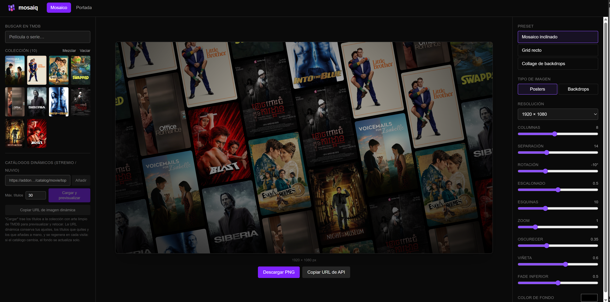
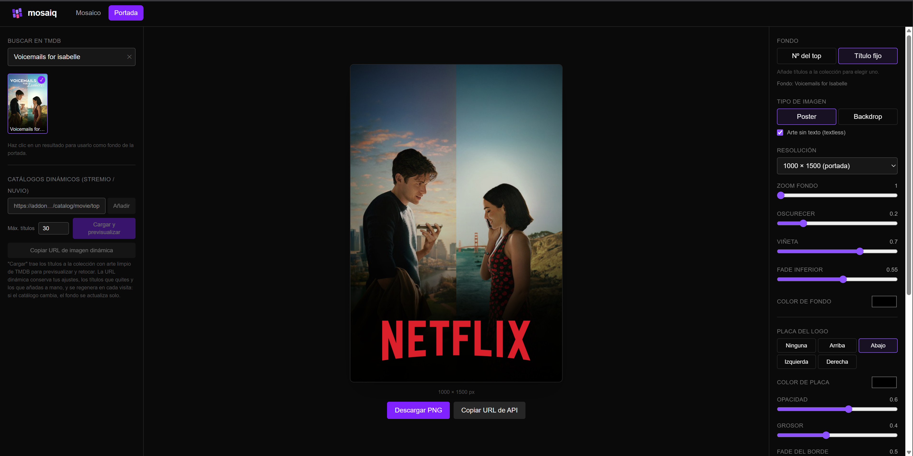

<p align="center">
  
</p>

A self-hosted asset and cover generator for Stremio, Nuvio, and Plex. Composites TMDB posters into dynamic mosaics, wallpapers, and covers with configurable presets. mosaiq is compatible with **Nuvio, Stremio addons, AIOMetadata, Bingecat, Plex, Jellyfin**, and any application that can pass TMDB IDs.

Those not self-hosting can [visit the public instance.](https://mosaiq.mangelcc.dev)

---

## Showcase

<p align="center">
  
  
</p>

---

## Features

- **Multiple presets** - Netflix-style tilted mosaic, grid layout, backdrop collage, and custom configurations. Each preset is fully customizable with 15+ parameters.

- **Dynamic catalog support** - load covers from Stremio/Nuvio catalog URLs (top movies, new releases, by genre). Mosaics auto-update when the source catalog changes.

- **Cover generation** - create portrait/landscape covers with poster backgrounds, metadata overlays, platform logos, and custom text. Ideal for Nuvio headers.

- **Wallpaper export** - generate high-resolution wallpapers (up to 4K) from any collection, perfect for Jellyfin/Plex hero imagery or Nuvio backdrops.

- **Web configurator** - browser-based UI to tune every parameter (columns, gap, rotation, corner radius, zoom, filters, overlays) with real-time preview. Export a ready-to-use URL template.

- **REST API** - generate assets dynamically via HTTP. Pass TMDB poster paths, catalog URLs, and config params; receive PNG at any resolution.

- **TMDB integration** - search for movies and series directly in the editor. Posters and backdrops fetched from TMDB with metadata support.

- **High-performance rendering** - serverless Canvas rendering with aggressive caching. Repeat requests served from cache; first render is background-optimized.

- **Responsive editor** - desktop, tablet, and mobile support. On mobile, canvas previews first, followed by detailed controls.

---

## Self-Hosted Requirements

- Docker
- A free [TMDB API key](https://www.themoviedb.org/settings/api) for poster fetching and metadata.
- (Optional) An [AIOMetadata](https://github.com/cedya77/aiometadata) instance if using external metadata aggregation. Plex and Jellyfin don't require this.

---

## Quick Start

### Using Docker (recommended)

Create a `compose.yaml`:

```yaml
services:
  mosaiq:
    image: ghcr.io/mangelcc/mosaiq:latest
    ports:
      - "3000:3000"
    restart: unless-stopped
    volumes:
      - ./mosaiq-cache:/app/.next/cache
    environment:
      - TMDB_API_KEY=your_tmdb_key
      - NODE_ENV=production
      # (Optional) For AIOMetadata proxy protection:
      # - ACCESS_KEY=yoursecretkey
```

Start it:

```bash
docker compose up -d
```

Open `http://localhost:3000` to configure.

### Building from source

```bash
git clone https://github.com/mangelcc/mosaiq.git
cd mosaiq
cp .env.example .env   # fill in TMDB_API_KEY
npm install
npm run dev            # http://localhost:3000
npm run build && npm start  # production
```

---

## Configuration

All configuration is done via environment variables or the web UI.

| Variable | Default | Description |
|---|---|---|
| `TMDB_API_KEY` | - | TMDB API key for poster/metadata fetching (required) |
| `NODE_ENV` | development | Set to `production` for serverless deployment |
| `ACCESS_KEY` | - | Optional shared secret for API authentication. Leave blank for open access. |
| `NEXT_PUBLIC_API_BASE` | `/api` | Base URL for API calls (change if behind a proxy) |
| `MOSAIQ_DB_URL` | `file:./data/mosaiq.db` | User profile store location (see [User Profiles](#user-profiles)): a local file for self-hosted Docker, or a `libsql://...` Turso URL for serverless deployments |
| `MOSAIQ_DB_AUTH_TOKEN` | - | Auth token for a remote `MOSAIQ_DB_URL` (not needed for a local file) |
| `TOKEN_ENCRYPTION_KEY` | - | Required to save any personal TMDB/ImageKit credential to a profile. Generate with `node -e "console.log(require('crypto').randomBytes(32).toString('base64'))"` |

All other parameters (mosaic columns, gap, rotation, filters, overlays) are configured via the web UI or passed as query parameters to the REST API.

---

## User Profiles

On the public hosted instance (or any deployment under heavy load), you can bring your own
TMDB and ImageKit API keys instead of sharing the server's quota. Profiles are opt-in and
identified by a single opaque UUID token — never by an account or email.

- In the Editor, open the profile panel and enter your TMDB and/or ImageKit key. This
  creates a profile and returns a UUID token.
- Your raw keys are encrypted at rest (`TOKEN_ENCRYPTION_KEY`) and are **never** sent
  anywhere except directly to TMDB/ImageKit from the server — not to Nuvio, not to Stremio,
  not back to your browser after the initial save.
- Only the UUID token travels in URLs (e.g. pasted into a Nuvio collection), since it
  identifies your profile server-side but reveals nothing on its own.
- The same token also lets you save Editor configurations ("creations") and reload or edit
  them later from any device — just re-enter the token.
- **The token is unrecoverable if lost** — there's no email/password recovery, since none is
  collected. Save it somewhere safe.

Requires `MOSAIQ_DB_URL` and `TOKEN_ENCRYPTION_KEY` to be set (see Configuration above); with
neither set, profiles are simply unavailable and the server behaves as before. See
[`specs/003-user-profiles/`](specs/003-user-profiles/) for the full design and API contract.

---

## URL Structure

Assets are generated dynamically via REST endpoints:

### Mosaic endpoint

```
GET /api/render?preset=netflix&w=1920&h=1080&cols=8&imgs=/path1,/path2,/path3
```

**Parameters:**
- `preset` - `netflix` | `grid` | `backdrops`
- `type` - `poster` | `backdrop`
- `w`, `h` - output width and height
- `cols` - number of columns
- `gap` - gap between tiles
- `rot` - rotation in degrees
- `stagger` - stagger offset (0–1)
- `radius` - corner radius
- `darken` - overlay darkness (0–1)
- `vignette` - vignette effect (0–1)
- `fade` - bottom fade (0–1)
- `scale` - zoom level
- `bg` - background color (hex, no #)
- `imgs` - comma-separated TMDB poster paths
- `catalog` - URL to Stremio/Nuvio catalog (alternative to `imgs`)
- `limit` - max catalog items to render
- `key` - `ACCESS_KEY` if protected
- `token` - profile token from [User Profiles](#user-profiles): uses that profile's personal TMDB and/or ImageKit key instead of the shared server key, if registered
- `tmdb_key` - a raw personal TMDB key, used directly (secondary alternative to `token` — see below)
- `imagekit_key` - a raw personal ImageKit key, used directly (secondary alternative to `token` — see [CDN render caching](#cdn-render-caching) below)

**Example:**

```
/api/render?preset=netflix&w=1920&h=1080&catalog=https://v3-cinemeta.strem.io/catalog/movie/top.json&limit=30
```

### Cover endpoint

```
GET /api/cover?w=1000&h=1500&type=poster&img=/path&logo=https://logo.png&text=Genre
```

**Parameters:** width, height, poster/backdrop, background image, logo URL, text overlay, text styling. Also accepts `key`, `token`, `tmdb_key`, and `imagekit_key` as above.

### Bring your own TMDB key

Every endpoint that talks to TMDB (`/api/search`, `/api/render`, `/api/cover`, `/api/art`,
`/api/providers`) accepts an optional `token` or `tmdb_key` query parameter to use a personal
TMDB credential instead of the server's shared one:

- `token` - a UUID from [User Profiles](#user-profiles). **Recommended** for anything you'll
  store persistently (e.g. a Nuvio collection URL) — only the opaque token travels in the URL,
  never your raw key.
- `tmdb_key` - your raw TMDB key, used directly. Only recommended for one-off/direct API use
  (e.g. `curl` testing), not for anything saved outside mosaiq.

If both are supplied, `tmdb_key` wins. If neither resolves to a usable credential (including an
unknown/unregistered `token`), the request falls back to the server's `TMDB_API_KEY` unchanged —
supplying a personal key is always optional. A credential that TMDB itself rejects (invalid,
expired) returns a clear error instead of silently falling back to the server key.

### CDN render caching

`/api/render` and `/api/cover` normally re-render the PNG on every request. If you supply your
own [ImageKit](https://imagekit.io) credential — via `token` (recommended, see
[User Profiles](#user-profiles)) or a direct `imagekit_key` (secondary, same precedence rule as
`tmdb_key` above) — repeat requests for an unchanged configuration are served from your own
ImageKit media library instead of being re-rendered:

- **Cache miss** (first request, or the configuration/catalog content changed): `200` with the
  PNG body, same as always — the difference is the rendered image is also uploaded to your
  ImageKit account (under a dedicated `mosaiq-cache/` path) for next time.
- **Cache hit**: `302 Found` with a `Location` header pointing at your ImageKit delivery URL,
  instead of a `200` PNG body. Transparent to browsers, `` tags, `curl -L`, and Nuvio; visible
  only to callers that inspect the raw HTTP status.
- For `imgs=...` (explicit list) requests, any change to a parameter that affects the rendered
  output (dimensions, preset, overlays, the image list itself, etc.) produces a distinct cache
  entry — `key`, `token`, `tmdb_key`, and `imagekit_key` never affect the cache key.
- For `catalog=...` (dynamic) requests, the catalog's current content is fetched and checked on
  every request; the cached asset is reused only while that content is unchanged, and is
  automatically replaced (not left to accumulate) the moment it changes.
- Caching is entirely optional and has zero effect when unused: with no `token`/`imagekit_key`
  resolving a credential, behavior is identical to today. Likewise, any problem with your ImageKit
  account (invalid key, unreachable, quota) never breaks or delays the render itself — you always
  get a correctly rendered image back; caching for that request is just silently skipped.

See [`specs/002-cdn-render-cache/`](specs/002-cdn-render-cache/) for the full design and API
contract.

---

## Architecture

```
mosaiq/
├── src/
│   ├── app/
│   │   ├── api/
│   │   │   ├── render      # PNG mosaic generation
│   │   │   ├── cover       # Portrait/landscape covers
│   │   │   ├── search      # TMDB proxy
│   │   │   ├── catalog     # Catalog aggregator
│   │   │   ├── providers   # Platform logos
│   │   │   └── art         # Textless art fallback
│   │   ├── page.tsx        # Editor UI
│   │   └── layout.tsx      # Root layout
│   └── lib/
│       ├── mosaic.ts       # Rendering engine (Canvas)
│       ├── cover.ts        # Cover generator
│       ├── catalog.ts      # Catalog parser
│       └── tmdb.ts         # TMDB client
├── public/
│   └── logo.svg            # Branding
└── docker-compose.yml
```

**Tech stack:** Next.js 16 (App Router) + React 19 + Tailwind CSS 4 + @napi-rs/canvas (Node rendering)

The render engine is **pure Canvas 2D**, ensuring identical output between browser preview and serverless API.

---

## Deployment

### Vercel (recommended for most users)

```bash
npx vercel
```

Vercel auto-detects Next.js. Set `TMDB_API_KEY` in Project Settings > Environment Variables. Zero-config, scales to 2K+ concurrent users.

### Self-hosted (Docker on DigitalOcean / AWS / etc)

See the Quick Start section above. With Docker, you have full control over resources and can self-host indefinitely for ~$5–10/month.

### Cloudflare (via subdomain)

To point `mosaiq.yourdomain.com` to your deployment:

1. **Cloudflare Dashboard** → DNS
2. Add CNAME record:
   - Name: `mosaiq`
   - Target: `vercel.com` (or your host)
   - Proxied: ☑️ Orange cloud
3. In Vercel/Netlify project settings, add domain `mosaiq.yourdomain.com`

SSL is automatic with Cloudflare's orange cloud.

---

## Contributing

Contributions welcome! See [CONTRIBUTING.md](CONTRIBUTING.md) for guidelines.

---

## Support & Donate

If mosaiq is useful to you, consider supporting development:

- ⭐ Star the repo
- 💬 [Report bugs](https://github.com/mangelcc/mosaiq/issues) & suggest features
- ☕ [Ko-fi](https://ko-fi.com/mangelcc)
- 💪 [GitHub Sponsors](https://github.com/sponsors/mangelcc)
- 💻 [Contribute code](https://github.com/mangelcc/mosaiq/pulls)

Donations help maintain the public instance and accelerate feature development.

---

## License

[MIT License](LICENSE) — Use freely for personal and commercial purposes.

---

## Credits

- **TMDB** for poster and metadata access
- **Stremio** and **Nuvio** for catalog format inspiration
- **Next.js** and **Tailwind** for the foundation
- **Community** for feedback and contributions
